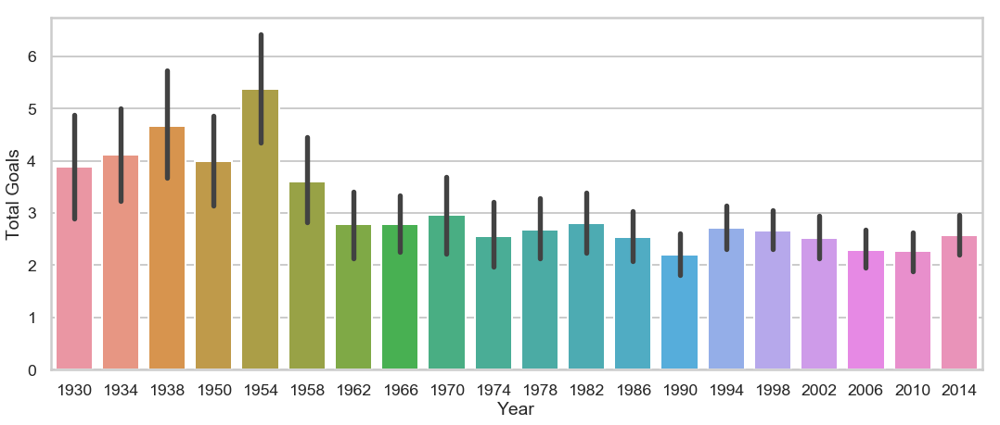

# World Cup Data



## World Cup Data

In this i will be exploring data using Jupyter Notebook to create an ETL (Extract Data from Excel the excel file, make some Transformations and Load the data to a Mysql Database) using Fifa World Cup Data from 1930-2014 to analyze trends and discover insights about the world's biggest game, soccer! 


## Usage 
There is a lot of information in the ***data/world.csv*** file so if you want to explore it just:

```sh
git clone https://github.com/doriel/World_Cup_Data_1930_to_2014.git
cd World_Cup_Data_1930_to_2014
jupyter notebook
```
Then on the browser go to ***http://localhost:8888*** and make the changes you wish.

## Thank You
[Pavan Raj](https://www.kaggle.com/pavanraj159/fifa-world-cup-1930-to-2014-data-analysis) for the information.


